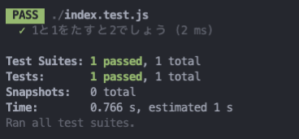
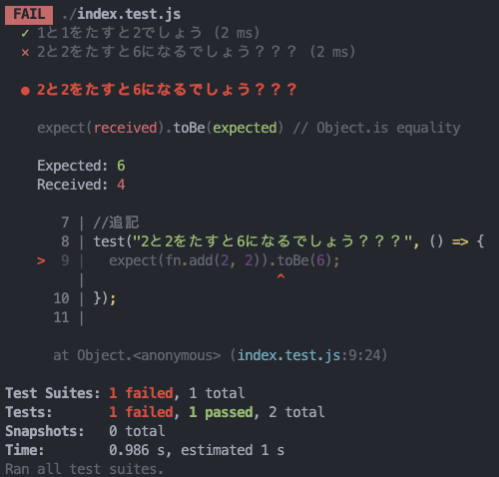

# Jest の紹介

`Jest` は React を作った Facebook 社が開発し、管理している Javascript Testing tool であります。`Jest` の哲学は`zero config`、別途のインストールや、設定無しで手早くテストコードを作成することであります。

Javascript のコードをテストするためのライブラリやフレイムワークはいくつかありますが、現在一番多く使われてるのは `Jest` です。


# インストール

とりあえずフォルダを一つ作成します。

```
mkdir tutorial
```

そして npm project 始めます。

```
npm init -y
```

その後`Jest`をインストールします。

```
npm install jest --save-dev
```

> 開発の時だけ使うので `--save-dev`もしくは`-D`を使用します。

インストールが終わったら`package.json`ファイルの中身を修正します。

`package.json`

```json
{
    ...
  "scripts": {
    "test": "jest"
  },
    ...
}
```

これからは`npm run test`で Jest のテストが実行されます。

---

簡単な関数を作成して Jest を使ってみましょう。

`index.js`

```javascript
const fn = {
  // 2つの値をもらい、その和をReturnする関数
  add: (num1, num2) => num1 + num2,
};

// Jestのテストで使えるよう書き出し
module.exports = fn;
```

それではテストコードを作成することになります。

同じ名前で拡張子に`.test`を付けます。Jest はテストを実行する時にプロジェクト内の全`.test`ファイルを見つけて実行します。一部ファイルだけテストする場合は`npm run test`の後に ファイル名や、フォルダー名を入れます。

> \_\_tests\_\_　フォルダーの中も該当

`index.test.js`

```javascript
// 先ほど作成したテストするファイルを読み込む
const fn = require("./index.js");

// テストコード
test("1と1をたすと2でしょう", () => {
  expect(fn.add(1, 1)).toBe(2);
});
```

`expect`に検証する値を入れ、`toBe`には期待する値を入れます。

> test の一番名の説明はどんなテストか誰でもわかるように書くのが理想的です。

そしてテストコマンドを実行します。

```
npm run test
```

下記のように成功の結果が見えたらテスト完了です。



今回は失敗するケースも試してみましょう。

`index.test.js`

```javascript
const fn = require("./index.js");

test("1と1をたすと2でしょう", () => {
  expect(fn.add(1, 1)).toBe(2);
});

//追記
test("2と2をたすと6になるでしょう？？？", () => {
  expect(fn.add(2, 2)).toBe(6);
});
```

`npm run test`で結果をみると下記のようになります。


テストケースの総 2 件の中 1 件はパス(成功)で 1 件が失敗だと言います。

失敗メッセージの中で`Expected:6, Received:4`、6 を期待したが 4 をもらったという内容があります。

---

上のテストファイルで肝心なところは`.toBe()`であります。これを`Matcher`と言います。`.toBe() Matcher`は値の一致を検証しますが、以外にも数多い`Matcher`が存在します。

[次のページ](./2.md)ではこの`Matcher`に関して作成します。
